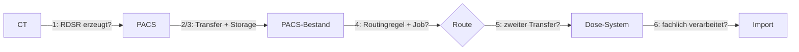

## „Die Untersuchung ist im PACS, aber im Dose-System fehlt sie"

Die CT-Serie ist vollständig, der Befund ist möglich. Im Dose-Management
taucht dieselbe Untersuchung trotzdem nicht auf.

Aus Lektion 3.7 kennst du bereits den Grundsatz: Storage-, Query-,
Display- und Routing-Unterstützung sind unabhängige Fähigkeiten, und ein
erfolgreicher C-STORE beweist keine davon automatisch für ein anderes
System. Diese Lektion wendet das konkret auf **einen** Objekttyp an —
den Dosisbericht (RDSR) — und geht einen Schritt weiter: Sie zeigt, wie
du den Inhalt dieses Objekts tatsächlich liest, nicht nur seine
Metadaten.

## Was genau ist das Objekt?

### RDSR ist strukturierte Information

Ein Radiation Dose Structured Report enthält Dosisinformationen nicht
als Screenshot, sondern als maschinenlesbare Inhalte in einem DICOM
Structured Report — dieselbe Objektfamilie, die du in Lektion 3.5
kennengelernt hast.

```text
$ dcmdump +P SOPClassUID +P Modality rdsr-ct-thorax.dcm
(0008,0016) UI =XRayRadiationDoseSRStorage              #  30, 1 SOPClassUID
(0008,0060) CS [SR]                                     #   2, 1 Modality
```

**Was du daran abliest:** `Modality` meldet nur `SR` — denselben Wert,
den jeder andere Structured Report auch melden würde. Erst
`SOPClassUID` (0008,0016) sagt präzise, dass hier ein
`XRayRadiationDoseSRStorage` vorliegt: der klassische X-Ray Radiation
Dose SR, `1.2.840.10008.5.1.4.1.1.88.67` (PS3.4 Annex B.5). `Modality =
SR` ist dabei nur eine grobe Einordnung — sie steht identisch bei einem
einfachen Befundtext, einem Key Object Selection Document oder einem
{{term:radiation-dose-structured-report}}. Nur die `SOPClassUID`
unterscheidet die drei konkret. Diese Lektion behandelt ausschließlich
das klassische X-Ray Radiation Dose SR `.88.67` — der Standard kennt
daneben weitere, eigenständige Dose-SR-SOP-Classes (z. B. für andere
Modalitäten); die hier gezeigten Werte und Content-IDs gelten nicht
automatisch für diese anderen SOP Classes.

Und ein Dose-Screenshot? Ein Secondary-Capture-Dose-Screenshot bleibt
semantisch etwas anderes als ein RDSR: Er kann für einen Menschen lesbar
sein, trägt aber keinen standardisierten, maschinenlesbaren
Content-Baum. Manche konkreten Dose-Systeme unterstützen zusätzlich
OCR-, Header-, MPPS- oder herstellerspezifische Quellen — das ändert
nichts daran, dass ein Screenshot nicht dieselbe strukturierte
Auswertbarkeit besitzt wie ein RDSR. Ob ein konkretes Produkt eine
dieser Zusatzquellen unterstützt, steht in seinem Conformance Statement,
nicht in dieser Lektion — und nicht jedes Dose-System erwartet
zwangsläufig ausschließlich RDSR.

## Wie liest man einen RDSR?

Ein Structured Report ist kein Fließtext und keine flache Tag-Liste,
sondern ein Baum aus codierten `CONTENT ITEM`s: Jedes Element hat einen
`ValueType` (z. B. `CONTAINER` für eine Gruppierung, `NUM` für einen
Messwert), einen `ConceptNameCodeSequence`-Code, der sagt, *was* das
Element bedeutet, und bei `NUM` zusätzlich einen Zahlenwert mit
codierter Einheit. Genau dieser Baum ist RDSRs eigentlicher Inhalt.

Ein echtes, per `pydicom` gebautes RDSR (Root-Template TID 10011, CT
Radiation Dose) — bewusst auf die für diese Lektion relevanten Zweige
gekürzt, kein vollständiges Conformance-Objekt:

```text
$ dcmdump rdsr-ct-thorax.dcm
(0008,0016) UI =XRayRadiationDoseSRStorage              #  30, 1 SOPClassUID
(0008,0060) CS [SR]                                     #   2, 1 Modality
[...]
(0040,a040) CS [CONTAINER]                              #  10, 1 ValueType
(0040,a043) SQ (Sequence with explicit length #=1)      #  70, 1 ConceptNameCodeSequence
  (fffe,e000) na (Item with explicit length #=3)          #  62, 1 Item
    (0008,0100) SH [113701]                                 #   6, 1 CodeValue
    (0008,0102) SH [DCM]                                    #   4, 1 CodingSchemeDesignator
    (0008,0104) LO [X-Ray Radiation Dose Report]            #  28, 1 CodeMeaning
  (fffe,e00d) na (ItemDelimitationItem for re-encoding)   #   0, 0 ItemDelimitationItem
(fffe,e0dd) na (SequenceDelimitationItem for re-encod.) #   0, 0 SequenceDelimitationItem
(0040,a050) CS [SEPARATE]                               #   8, 1 ContinuityOfContent
(0040,a491) CS [COMPLETE]                               #   8, 1 CompletionFlag
(0040,a493) CS [UNVERIFIED]                             #  10, 1 VerificationFlag
(0040,a730) SQ (Sequence with explicit length #=3)      # 1872, 1 ContentSequence
  (fffe,e000) na (Item with explicit length #=5)          # 568, 1 Item
    (0040,a010) CS [CONTAINS]                               #   8, 1 RelationshipType
    (0040,a040) CS [CONTAINER]                              #  10, 1 ValueType
    (0040,a043) SQ (Sequence with explicit length #=1)      #  66, 1 ConceptNameCodeSequence
      (fffe,e000) na (Item with explicit length #=3)          #  58, 1 Item
        (0008,0100) SH [113811]                                 #   6, 1 CodeValue
        (0008,0102) SH [DCM]                                    #   4, 1 CodingSchemeDesignator
        (0008,0104) LO [CT Accumulated Dose Data]               #  24, 1 CodeMeaning
      (fffe,e00d) na (ItemDelimitationItem for re-encoding)   #   0, 0 ItemDelimitationItem
    (fffe,e0dd) na (SequenceDelimitationItem for re-encod.) #   0, 0 SequenceDelimitationItem
    (0040,a050) CS [SEPARATE]                               #   8, 1 ContinuityOfContent
    (0040,a730) SQ (Sequence with explicit length #=2)      # 428, 1 ContentSequence
      (fffe,e000) na (Item with explicit length #=4)          # 208, 1 Item
        (0040,a010) CS [CONTAINS]                               #   8, 1 RelationshipType
        (0040,a040) CS [NUM]                                    #   4, 1 ValueType
        (0040,a043) SQ (Sequence with explicit length #=1)      #  76, 1 ConceptNameCodeSequence
          (fffe,e000) na (Item with explicit length #=3)          #  68, 1 Item
            (0008,0100) SH [113812]                                 #   6, 1 CodeValue
            (0008,0102) SH [DCM]                                    #   4, 1 CodingSchemeDesignator
            (0008,0104) LO [Total Number of Irradiation Events]     #  34, 1 CodeMeaning
          (fffe,e00d) na (ItemDelimitationItem for re-encoding)   #   0, 0 ItemDelimitationItem
        (fffe,e0dd) na (SequenceDelimitationItem for re-encod.) #   0, 0 SequenceDelimitationItem
        (0040,a300) SQ (Sequence with explicit length #=1)      #  80, 1 MeasuredValueSequence
          (fffe,e000) na (Item with explicit length #=2)          #  72, 1 Item
            (0040,08ea) SQ (Sequence with explicit length #=1)      #  50, 1 MeasurementUnitsCodeSequence
              (fffe,e000) na (Item with explicit length #=3)          #  42, 1 Item
                (0008,0100) SH [{events}]                               #   8, 1 CodeValue
                (0008,0102) SH [UCUM]                                   #   4, 1 CodingSchemeDesignator
                (0008,0104) LO [events]                                 #   6, 1 CodeMeaning
              (fffe,e00d) na (ItemDelimitationItem for re-encoding)   #   0, 0 ItemDelimitationItem
            (fffe,e0dd) na (SequenceDelimitationItem for re-encod.) #   0, 0 SequenceDelimitationItem
            (0040,a30a) DS [2]                                      #   2, 1 NumericValue
          (fffe,e00d) na (ItemDelimitationItem for re-encoding)   #   0, 0 ItemDelimitationItem
        (fffe,e0dd) na (SequenceDelimitationItem for re-encod.) #   0, 0 SequenceDelimitationItem
      (fffe,e00d) na (ItemDelimitationItem for re-encoding)   #   0, 0 ItemDelimitationItem
      (fffe,e000) na (Item with explicit length #=4)          # 204, 1 Item
        (0040,a010) CS [CONTAINS]                               #   8, 1 RelationshipType
        (0040,a040) CS [NUM]                                    #   4, 1 ValueType
        (0040,a043) SQ (Sequence with explicit length #=1)      #  70, 1 ConceptNameCodeSequence
          (fffe,e000) na (Item with explicit length #=3)          #  62, 1 Item
            (0008,0100) SH [113813]                                 #   6, 1 CodeValue
            (0008,0102) SH [DCM]                                    #   4, 1 CodingSchemeDesignator
            (0008,0104) LO [CT Dose Length Product Total]           #  28, 1 CodeMeaning
          (fffe,e00d) na (ItemDelimitationItem for re-encoding)   #   0, 0 ItemDelimitationItem
        (fffe,e0dd) na (SequenceDelimitationItem for re-encod.) #   0, 0 SequenceDelimitationItem
        (0040,a300) SQ (Sequence with explicit length #=1)      #  82, 1 MeasuredValueSequence
          (fffe,e000) na (Item with explicit length #=2)          #  74, 1 Item
            (0040,08ea) SQ (Sequence with explicit length #=1)      #  48, 1 MeasurementUnitsCodeSequence
              (fffe,e000) na (Item with explicit length #=3)          #  40, 1 Item
                (0008,0100) SH [mGy.cm]                                 #   6, 1 CodeValue
                (0008,0102) SH [UCUM]                                   #   4, 1 CodingSchemeDesignator
                (0008,0104) LO [mGy.cm]                                 #   6, 1 CodeMeaning
              (fffe,e00d) na (ItemDelimitationItem for re-encoding)   #   0, 0 ItemDelimitationItem
            (fffe,e0dd) na (SequenceDelimitationItem for re-encod.) #   0, 0 SequenceDelimitationItem
            (0040,a30a) DS [426.10]                                 #   6, 1 NumericValue
          (fffe,e00d) na (ItemDelimitationItem for re-encoding)   #   0, 0 ItemDelimitationItem
        (fffe,e0dd) na (SequenceDelimitationItem for re-encod.) #   0, 0 SequenceDelimitationItem
      (fffe,e00d) na (ItemDelimitationItem for re-encoding)   #   0, 0 ItemDelimitationItem
    (fffe,e0dd) na (SequenceDelimitationItem for re-encod.) #   0, 0 SequenceDelimitationItem
  (fffe,e00d) na (ItemDelimitationItem for re-encoding)   #   0, 0 ItemDelimitationItem
  (fffe,e000) na (Item with explicit length #=5)          # 640, 1 Item
    (0040,a010) CS [CONTAINS]                               #   8, 1 RelationshipType
    (0040,a040) CS [CONTAINER]                              #  10, 1 ValueType
    (0040,a043) SQ (Sequence with explicit length #=1)      #  56, 1 ConceptNameCodeSequence
      (fffe,e000) na (Item with explicit length #=3)          #  48, 1 Item
        (0008,0100) SH [113819]                                 #   6, 1 CodeValue
        (0008,0102) SH [DCM]                                    #   4, 1 CodingSchemeDesignator
        (0008,0104) LO [CT Acquisition]                         #  14, 1 CodeMeaning
      (fffe,e00d) na (ItemDelimitationItem for re-encoding)   #   0, 0 ItemDelimitationItem
    (fffe,e0dd) na (SequenceDelimitationItem for re-encod.) #   0, 0 SequenceDelimitationItem
    (0040,a050) CS [SEPARATE]                               #   8, 1 ContinuityOfContent
    (0040,a730) SQ (Sequence with explicit length #=1)      # 510, 1 ContentSequence
      (fffe,e000) na (Item with explicit length #=5)          # 502, 1 Item
        (0040,a010) CS [CONTAINS]                               #   8, 1 RelationshipType
        (0040,a040) CS [CONTAINER]                              #  10, 1 ValueType
        (0040,a043) SQ (Sequence with explicit length #=1)      #  50, 1 ConceptNameCodeSequence
          (fffe,e000) na (Item with explicit length #=3)          #  42, 1 Item
            (0008,0100) SH [113829]                                 #   6, 1 CodeValue
            (0008,0102) SH [DCM]                                    #   4, 1 CodingSchemeDesignator
            (0008,0104) LO [CT Dose]                                #   8, 1 CodeMeaning
          (fffe,e00d) na (ItemDelimitationItem for re-encoding)   #   0, 0 ItemDelimitationItem
        (fffe,e0dd) na (SequenceDelimitationItem for re-encod.) #   0, 0 SequenceDelimitationItem
        (0040,a050) CS [SEPARATE]                               #   8, 1 ContinuityOfContent
        (0040,a730) SQ (Sequence with explicit length #=2)      # 378, 1 ContentSequence
          (fffe,e000) na (Item with explicit length #=4)          # 182, 1 Item
            (0040,a010) CS [CONTAINS]                               #   8, 1 RelationshipType
            (0040,a040) CS [NUM]                                    #   4, 1 ValueType
            (0040,a043) SQ (Sequence with explicit length #=1)      #  54, 1 ConceptNameCodeSequence
              (fffe,e000) na (Item with explicit length #=3)          #  46, 1 Item
                (0008,0100) SH [113830]                                 #   6, 1 CodeValue
                (0008,0102) SH [DCM]                                    #   4, 1 CodingSchemeDesignator
                (0008,0104) LO [Mean CTDIvol]                           #  12, 1 CodeMeaning
              (fffe,e00d) na (ItemDelimitationItem for re-encoding)   #   0, 0 ItemDelimitationItem
            (fffe,e0dd) na (SequenceDelimitationItem for re-encod.) #   0, 0 SequenceDelimitationItem
            (0040,a300) SQ (Sequence with explicit length #=1)      #  76, 1 MeasuredValueSequence
              (fffe,e000) na (Item with explicit length #=2)          #  68, 1 Item
                (0040,08ea) SQ (Sequence with explicit length #=1)      #  44, 1 MeasurementUnitsCodeSequence
                  (fffe,e000) na (Item with explicit length #=3)          #  36, 1 Item
                    (0008,0100) SH [mGy]                                    #   4, 1 CodeValue
                    (0008,0102) SH [UCUM]                                   #   4, 1 CodingSchemeDesignator
                    (0008,0104) LO [mGy]                                    #   4, 1 CodeMeaning
                  (fffe,e00d) na (ItemDelimitationItem for re-encoding)   #   0, 0 ItemDelimitationItem
                (fffe,e0dd) na (SequenceDelimitationItem for re-encod.) #   0, 0 SequenceDelimitationItem
                (0040,a30a) DS [8.50]                                   #   4, 1 NumericValue
              (fffe,e00d) na (ItemDelimitationItem for re-encoding)   #   0, 0 ItemDelimitationItem
            (fffe,e0dd) na (SequenceDelimitationItem for re-encod.) #   0, 0 SequenceDelimitationItem
          (fffe,e00d) na (ItemDelimitationItem for re-encoding)   #   0, 0 ItemDelimitationItem
          (fffe,e000) na (Item with explicit length #=4)          # 180, 1 Item
            (0040,a010) CS [CONTAINS]                               #   8, 1 RelationshipType
            (0040,a040) CS [NUM]                                    #   4, 1 ValueType
            (0040,a043) SQ (Sequence with explicit length #=1)      #  46, 1 ConceptNameCodeSequence
              (fffe,e000) na (Item with explicit length #=3)          #  38, 1 Item
                (0008,0100) SH [113838]                                 #   6, 1 CodeValue
                (0008,0102) SH [DCM]                                    #   4, 1 CodingSchemeDesignator
                (0008,0104) LO [DLP]                                    #   4, 1 CodeMeaning
              (fffe,e00d) na (ItemDelimitationItem for re-encoding)   #   0, 0 ItemDelimitationItem
            (fffe,e0dd) na (SequenceDelimitationItem for re-encod.) #   0, 0 SequenceDelimitationItem
            (0040,a300) SQ (Sequence with explicit length #=1)      #  82, 1 MeasuredValueSequence
              (fffe,e000) na (Item with explicit length #=2)          #  74, 1 Item
                (0040,08ea) SQ (Sequence with explicit length #=1)      #  48, 1 MeasurementUnitsCodeSequence
                  (fffe,e000) na (Item with explicit length #=3)          #  40, 1 Item
                    (0008,0100) SH [mGy.cm]                                 #   6, 1 CodeValue
                    (0008,0102) SH [UCUM]                                   #   4, 1 CodingSchemeDesignator
                    (0008,0104) LO [mGy.cm]                                 #   6, 1 CodeMeaning
                  (fffe,e00d) na (ItemDelimitationItem for re-encoding)   #   0, 0 ItemDelimitationItem
                (fffe,e0dd) na (SequenceDelimitationItem for re-encod.) #   0, 0 SequenceDelimitationItem
                (0040,a30a) DS [221.00]                                 #   6, 1 NumericValue
              (fffe,e00d) na (ItemDelimitationItem for re-encoding)   #   0, 0 ItemDelimitationItem
            (fffe,e0dd) na (SequenceDelimitationItem for re-encod.) #   0, 0 SequenceDelimitationItem
          (fffe,e00d) na (ItemDelimitationItem for re-encoding)   #   0, 0 ItemDelimitationItem
        (fffe,e0dd) na (SequenceDelimitationItem for re-encod.) #   0, 0 SequenceDelimitationItem
      (fffe,e00d) na (ItemDelimitationItem for re-encoding)   #   0, 0 ItemDelimitationItem
    (fffe,e0dd) na (SequenceDelimitationItem for re-encod.) #   0, 0 SequenceDelimitationItem
  (fffe,e00d) na (ItemDelimitationItem for re-encoding)   #   0, 0 ItemDelimitationItem
```

**Was du daran abliest:** Der Root-Content-Item trägt `ValueType
CONTAINER` mit dem Code `(113701, DCM, "X-Ray Radiation Dose Report")`
— das ist TID 10011, die Wurzel jedes RDSR. Direkt darunter, als erstes
Element der `ContentSequence`, folgt ein zweiter `CONTAINER` mit Code
`(113811, DCM, "CT Accumulated Dose Data")` (TID 10012) — der
Gesamtwerte-Block. Seine eigene `ContentSequence` enthält zwei
`NUM`-Elemente: `(113812, "Total Number of Irradiation Events")` mit
Zahlenwert `2` und Einheit `{events}`/`events` (UCUM), sowie `(113813,
"CT Dose Length Product Total")` mit Zahlenwert `426.10` und Einheit
`mGy.cm` (UCUM) — beide über `MeasuredValueSequence` codiert, nie als
freier Text. Danach folgt (zweites Element der äußeren
`ContentSequence`) ein `CONTAINER` mit Code `(113819, "CT Acquisition")`
— ein einzelnes Irradiation Event (TID 10013). Seine `ContentSequence`
enthält wiederum einen `CONTAINER` `(113829, "CT Dose")`, und darin zwei
`NUM`-Elemente: `(113830, "Mean CTDIvol")` = `8.50 mGy` und `(113838,
"DLP")` = `221.00 mGy.cm` — die Dosiswerte *dieses einen* Events. Die
Datei enthält ein zweites, strukturell identisches `CT
Acquisition`-Element (`Mean CTDIvol` `7.90 mGy`, `DLP` `205.10 mGy.cm`),
hier aus Platzgründen nicht erneut abgedruckt.

Damit lässt sich der Gesamtwert auch nachrechnen: `221.00 + 205.10 =
426.10` — genau der `CT Dose Length Product Total`-Wert von oben, bei
`Total Number of Irradiation Events = 2`. Ein RDSR trägt also sowohl
Gesamtwerte als auch Werte je einzelnem Irradiation Event, und der
Standard erlaubt für `TID 10013` ausdrücklich `1-n` Events — bei mehr
als einer CT-Serie in derselben Untersuchung ist das der Normalfall,
kein Sonderfall.

Eine Study kann außerdem mehr als eine RDSR-Instance enthalten (z. B.
bei nachträglicher Korrektur oder mehreren getrennten Untersuchungen
derselben Study) — „ein RDSR pro Study" ist keine Regel, auf die du dich
verlassen darfst.

## Was darf man aus den Werten ableiten – und was nicht?

`CTDIvol` und `DLP` sind standardisierte Dosisindizes: Protokoll- und
Gerätewerte, die aus der Scanner-Einstellung berechnet werden — nicht
automatisch die individuelle absorbierte Organdosis dieser einen
Patientin. `DLP` ist außerdem nicht ohne Weiteres gleich der effektiven
Dosis; eine Umrechnung bräuchte zusätzliche, körperregionabhängige
Umrechnungsfaktoren, die ein RDSR nicht selbst mitliefert (`CT Effective
Dose Total`, TID 10012 Zeile 4, ist ein separates, optionales Feld mit
eigener Berechnungsmethode).

Diese Lektion vermittelt deshalb technische Interpretation und
Workflow-Diagnostik — lesen, zuordnen, auf Vollständigkeit prüfen. Keine
medizinphysikalische Dosisbewertung, keine Grenzwertentscheidung: Ob ein
konkreter Wert für ein konkretes Protokoll und eine konkrete Patientin
angemessen ist, entscheidet die Medizinphysik anhand von
Referenzwerten — nicht diese Lektion.

## Sechs Stationen, sechs mögliche Fehler

Bei „Dosisdaten fehlen" hilft eine durchgehende Evidenzkette mehr als
eine pauschale Vermutung. Sechs Stationen, jede einzeln zu belegen:

### 1. Erzeugt die Modalität überhaupt ein RDSR?

Nicht jede Gerätekonfiguration erzeugt automatisch denselben Objekttyp
— Herstelleroptionen, Softwarestände und Protokolle entscheiden mit. Die
erste Frage lautet deshalb: Ist auf Senderseite überhaupt eine
RDSR-Instance entstanden?

### 2. Wird der erste Transfer angenommen?

C-ECHO kann erfolgreich sein und CT Image Storage kann funktionieren,
während die RDSR-SOP-Class im Presentation Context eigenständig
abgelehnt wird — derselbe Grundsatz wie bei jedem anderen zusätzlichen
Objekttyp (Lektion 3.7).

### 3. Speichert und indexiert das PACS die Instance?

Ein Archiv kann einen Objekttyp annehmen, aber intern anders behandeln.
Prüfe, ob die konkrete RDSR-Instance im Bestand tatsächlich auffindbar
ist.

### 4. Wählt eine Routingregel sie aus und legt einen Job an?

Ein PACS-interner Router entscheidet anhand konfigurierter Bedingungen,
welche Objekte an welches Ziel weitergeleitet werden. **„Kein
Weiterleitungsauftrag entstanden" ist dabei etwas anderes als
„Auftrag fehlgeschlagen" (`failed`)**: Ersteres bedeutet, das Objekt
wurde von der Regel nie ausgewählt — Letzteres würde einen tatsächlich
unternommenen, aber abgelehnten Versuch voraussetzen.

### 5. Nimmt das Ziel den zweiten Transfer an?

Viele Dose-Systeme bekommen ihre Daten nicht direkt von der Modalität,
sondern über einen zweiten, unabhängigen DICOM-Hop ab PACS oder Router —
eigene Association, eigene SOP-Class- und Transfer-Syntax-Aushandlung.
Ein erfolgreicher erster Hop sagt darüber nichts aus.

### 6. Verarbeitet das Dose-Management die Instance fachlich?

**Storage-Annahme ist etwas anderes als fachliche Verarbeitung.** Ein
Dose-System kann ein RDSR per C-STORE entgegennehmen und trotzdem beim
Import, Parsen oder der fachlichen Auswertung scheitern — ein
erfolgreicher C-STORE beweist nur die Annahme, nicht die Auswertung.

<!-- kein-beispiel -->


Ein grüner erster Pfeil sagt nichts über die folgenden fünf aus — jede
Station braucht ihren eigenen Beleg.

## Kurzes Beispiel: RDSR im PACS, aber kein Routingjob

Eine Study zeigt im PACS-Bestand vier gespeicherte Instances: drei
CT-Bilder und ein RDSR. Die Routing-Jobübersicht des PACS für das
konfigurierte Weiterleitungsziel zeigt für die drei CT-Bilder je einen
Eintrag mit Status `sent` — für das RDSR **keinen einzigen Eintrag**,
weder `sent` noch `failed`.

| Beobachtung | Belegt | Belegt nicht |
|---|---|---|
| RDSR im PACS-Bestand vorhanden | Stationen 1–3 erfüllt | Stationen 4–6 |
| Drei CT-Bilder haben je einen `sent`-Job | Routing/Ziel funktionieren grundsätzlich | dass dieselbe Regel auch das RDSR trifft |
| RDSR hat keinen Job-Eintrag | Die Route hat das RDSR nie ausgewählt | einen fehlgeschlagenen Transfer (der würde einen Job-Eintrag mit `failed` hinterlassen) |

Die erste fehlerhafte Stelle liegt damit vor jedem zweiten Transfer —
in der Objektauswahl der Routingregel selbst, nicht im Netzwerk, nicht
im Dose-System.

## Saubere betriebliche Diagnose und Maßnahme

Wenn eine Routingregel nach `Modality` selektiert, schließt sie jeden
Objekttyp aus, dessen `Modality` nicht dem konfigurierten Wert
entspricht — ein RDSR trägt unabhängig vom erzeugenden Gerät immer
`Modality = SR`. Die Regel einfach um `SR` zu erweitern, ist keine
saubere Lösung: `SR` umfasst jeden Structured Report, nicht nur
Dosisberichte, und würde ungeprüft auch andere SR-Objekttypen an das
Dose-System weiterleiten. Sauberer ist eine eigene, zusätzliche
Auswahlbedingung anhand der SOP Class des Dosisberichts selbst
(`1.2.840.10008.5.1.4.1.1.88.67`) — als eigene Regel oder als eigener
SOP-Class-Match neben der bestehenden Modality-Bedingung, nie als
zusätzliche UND-Bedingung an derselben Regel (das würde weiterhin
ausschließlich CT-Bilder treffen). Nach einer Änderung: erneut
auswerten lassen, prüfen, dass tatsächlich ein Auftrag entsteht, den
zweiten Transfer verifizieren und den Empfang am Ziel bestätigen.

## Lab

Zwei Übungen zu derselben Fehlerklasse, unterschiedlich vertieft:

Im Node **„Die Dosis bleibt liegen"** arbeitest du dich als geführter
Fall Schritt für Schritt durch die komplette Evidenzkette — jede Station
liegt bereits als Log-Ausschnitt vor, du wählst pro Schritt die richtige
Schlussfolgerung.

Im Node **„Gefiltert"** untersuchst du einen verwandten Fall direkt im
Terminal: Mit dem Werkzeug `pacs` schaust du dem simulierten PACS beim
Weiterleiten selbst zu — `pacs objects`, `pacs jobs`, `pacs events`,
`pacs route show` und `pacs route test` zeigen dir die Evidenz nicht
vorsortiert, sondern so, wie du sie im echten Betrieb selbst
zusammensuchen müsstest.

## Im Alltag heißt das

Bei „Dosisdaten fehlen" sammelst du entlang der Objektkette pro Station
einen Beleg:

| Station | Beleg |
|---|---|
| Modalität | RDSR-Instance erzeugt |
| Association | RDSR-SOP-Class akzeptiert |
| PACS | Instance gespeichert und indexiert |
| Routing | Regel hat gematcht, Weiterleitungsauftrag angelegt |
| Zweiter Transfer | Ziel hat die Instance angenommen |
| Dose-Management | Instance fachlich verarbeitet/importiert |

Damit wird aus einem diffusen „Schnittstellenproblem" eine konkrete
Stelle in einer Kette.

## Stolperfallen

- **Bildtransfer als Beweis für RDSR-Transfer verwenden.** Eigene SOP
  Class, eigene Verhandlung.
- **Dose-Screenshot und RDSR gleichsetzen.** Ein sichtbares Bild ist
  nicht dasselbe wie ein strukturierter, maschinenlesbarer Content-Baum.
- **„Kein Job" mit „Job fehlgeschlagen" verwechseln.** Ersteres heißt
  „nie ausgewählt", Letzteres setzt einen unternommenen Versuch voraus.
- **C-ECHO als Beleg für SOP-Class-Unterstützung nehmen.** C-ECHO prüft
  nur die Verification SOP Class, nie Storage-Fähigkeit für einen
  anderen Objekttyp.
- **Erfolgreichen C-STORE mit erfolgreicher Verarbeitung gleichsetzen.**
  Ein Ziel kann eine Instance annehmen und trotzdem bei Import oder
  Auswertung scheitern.
- **CTDIvol/DLP als individuelle Patientendosis lesen.** Beides sind
  Protokoll-/Geräteindizes, keine gemessene Organdosis dieser einen
  Patientin.
- **„Ein RDSR pro Study" annehmen.** Der Standard erlaubt mehrere
  RDSR-Instanzen je Study.

## Selbstcheck

1. Woran erkennst du ein RDSR eindeutig — und warum reicht `Modality`
   dafür nicht?
2. Nenne die sechs Stationen, die du bei fehlenden Dosisdaten prüfst,
   und wo `dosis-bleibt-liegen` und `gefiltert` sich in ihrer
   Herangehensweise unterscheiden.
3. Im gezeigten `dcmdump`-Ausschnitt liegt `Mean CTDIvol` innerhalb des
   Containers `CT Dose`, der wiederum innerhalb von `CT Acquisition`
   liegt. Was sagt diese Verschachtelung darüber aus, zu welchem
   Irradiation Event der Wert gehört?
4. Warum beweist ein erfolgreicher C-STORE beim Dose-System nicht, dass
   die Dosiswerte dort auch fachlich verarbeitet wurden?

## Quiz

*Wissenskarten — kommen später zur Wiederholung zurück.*

**q1 — Ein CT sendet seine CT-Bilder erfolgreich ins PACS. Das RDSR ist ebenfalls im PACS-Bestand vorhanden. Welche Aussage ist danach gerechtfertigt?**
1. Damit ist automatisch auch die Weiterleitung ans Dose-System erfolgt
2. RDSR und Bilder sind unterschiedliche Objekte mit eigener SOP Class — ob das RDSR das Dose-System erreicht, ist eine eigene, noch offene Frage
3. Ein erfolgreicher Bildtransfer beweist, dass auch das RDSR fachlich verarbeitet wurde
4. Damit ist bewiesen, dass mindestens ein CTDIvol-Wert im RDSR über einem Referenzwert liegt

**q2 — Im PACS-Bestand ist das RDSR vorhanden, in der Routing-Jobübersicht taucht für dieses Objekt aber kein Eintrag auf. Was bedeutet das?**
1. Der Transfer zum Dose-System ist fehlgeschlagen (`failed`)
2. Für dieses Objekt wurde nie ein Weiterleitungsauftrag angelegt — etwas anderes als ein gescheiterter Auftrag
3. Das Dose-System hat das Objekt abgelehnt
4. Das RDSR ist beschädigt

**q3 — Welche Aussagen zum gezeigten `dcmdump`-Ausschnitt stimmen?** *(Mehrfachauswahl)*
1. Der Code `(113811, DCM, "CT Accumulated Dose Data")` kennzeichnet den Container mit den Gesamtwerten
2. Der Code `(113819, DCM, "CT Acquisition")` kennzeichnet ein einzelnes Irradiation Event
3. „Total Number of Irradiation Events" liegt als `ValueType TEXT` vor
4. Der `DLP`-Gesamtwert im Container „CT Accumulated Dose Data" trägt die Einheit `mGy.cm`

**q4 — Welche Aussagen zu CTDIvol und DLP stimmen?** *(Mehrfachauswahl)*
1. `Mean CTDIvol` wird typischerweise in `mGy` angegeben
2. `DLP` wird typischerweise in `mGy.cm` angegeben
3. `Mean CTDIvol` entspricht der individuellen Organdosis dieser einen Patientin
4. Ein RDSR kann sowohl Gesamtwerte als auch Werte je einzelnem Irradiation Event enthalten

**q5 — Ein RDSR ist nachweislich per C-STORE erfolgreich im Dose-Management-System gespeichert. Was folgt daraus NICHT automatisch?**
1. Das Objekt ist als Instance im Dose-System vorhanden
2. Das Dose-System hat die enthaltenen Dosiswerte fachlich importiert und ausgewertet
3. Die Association für diesen Transfer wurde akzeptiert
4. Der zweite Transfer PACS → Dose-System war technisch erfolgreich
