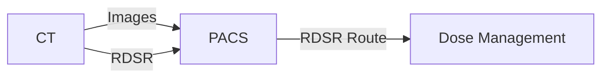

## „Die Untersuchung ist im PACS, aber im Dose-System fehlt sie"

Die CT-Serie ist vollständig. Der Befund ist möglich. Im Dose-Management taucht die Untersuchung trotzdem nicht auf.

Genau hier hilft die Denkweise aus dem Troubleshooting-Track: **Nicht den ganzen Workflow als einen Transfer behandeln.** Bildübertragung und Dosisübertragung können zwei unterschiedliche DICOM-Objekte, zwei unterschiedliche SOP Classes und sogar zwei unterschiedliche Routen sein.

Ein CT kann seine Images korrekt senden und beim RDSR trotzdem scheitern.

## RDSR ist strukturierte Information

Ein Radiation Dose Structured Report enthält Dosisinformationen nicht als sichtbaren Screenshot, sondern als maschinenlesbare Inhalte in einem DICOM Structured Report.

Das ist für PACS-Administration wichtig, weil ein Screenshot für Menschen lesbar sein kann, aber für automatische Auswertung kaum zuverlässig nutzbar ist. Ein Dose-Management-System erwartet deshalb typischerweise die strukturierte Information oder eine andere explizit unterstützte Quelle.

```text
$ dcmdump +P SOPClassUID +P Modality dosisbericht.dcm
(0008,0016) UI =XRayRadiationDoseSRStorage              #  30, 1 SOPClassUID
(0008,0060) CS [SR]                                     #   2, 1 Modality
```

**Was du daran abliest:** Die Datei ist als RDSR-Objekt gekennzeichnet — `dcmdump` löst die SOP-Class-UID zu `XRayRadiationDoseSRStorage` auf. Du suchst bei einem fehlenden Dosisworkflow deshalb nicht nach `PixelData`, sondern prüfst die SR-SOP-Class und die Route dieses Objekttyps.

## Vier Stationen, vier mögliche Fehler

### 1. Erzeugt die Modalität überhaupt RDSR?

Nicht jede Gerätekonfiguration erzeugt automatisch denselben Objekttyp. Herstelleroptionen, Softwarestände und Protokolle können bestimmen, ob ein RDSR entsteht.

Die erste Frage lautet daher nicht „Hat das PACS ihn verloren?“, sondern: **Ist auf Senderseite eine RDSR-Instance entstanden?**

### 2. Wird die SOP Class auf der Association akzeptiert?

C-ECHO kann erfolgreich sein und CT Image Storage kann funktionieren, während die RDSR-SOP-Class im Presentation Context abgelehnt wird. Das ist derselbe Grundsatz wie bei jedem anderen zusätzlichen Objekttyp.

### 3. Speichert das PACS den RDSR?

Ein Archiv kann einen Objekttyp annehmen, intern anders klassifizieren oder nach konfigurierten Regeln weiterleiten. Prüfe deshalb, ob die konkrete RDSR-Instance im Archivbestand auftaucht.

### 4. Wird sie an das richtige Ziel weitergeleitet?

Viele Dose-Systeme bekommen ihre Daten nicht direkt von der Modalität, sondern über PACS oder einen DICOM-Router. Dann ist der zweite Hop ein eigener DICOM-Transfer mit eigener AE-Title-, Port-, SOP-Class- und Transfer-Syntax-Konfiguration.

<!-- kein-beispiel -->


Ein grüner erster Pfeil sagt nichts über den zweiten und dritten aus.

## Im Alltag heißt das

Bei „Dosisdaten fehlen“ gehst du entlang der Objektkette und sammelst pro Station einen Beleg:

| Station | Beleg |
|---|---|
| Modalität | RDSR-Instance erzeugt |
| Association | RDSR-SOP-Class akzeptiert |
| PACS | Instance gespeichert/indexiert |
| Routing | Weiterleitungsjob angelegt und erfolgreich |
| Dose-System | Instance empfangen und verarbeitet |

Damit wird aus einem diffusen „Schnittstellenproblem“ eine konkrete Stelle in einer Kette.

## Stolperfallen

- **Bildtransfer als Beweis für RDSR-Transfer verwenden.** Andere SOP Class, andere Verhandlung.
- **Dose-Screenshot und RDSR gleichsetzen.** Ein sichtbares Bild ist nicht dasselbe wie strukturierte Dosisdaten.
- **Nur den ersten Hop prüfen.** PACS → Dose-System ist eine neue Verbindung.
- **Storage und Verarbeitung vermischen.** Das Ziel kann die Instance empfangen und bei der fachlichen Verarbeitung trotzdem scheitern.

## Lab

Im Node **„Die Dosis bleibt liegen"** verfolgst du einen Dosisbericht
über die komplette Kette Modalität → PACS → Dose-System und findest
heraus, warum „im PACS vorhanden" noch lange nicht bedeutet, dass das
Dose-System ihn erhalten hat.

Im Node **„Gefiltert"** untersuchst du einen verwandten Fall direkt im
Terminal: Mit dem Werkzeug `pacs` schaust du dem simulierten PACS beim
Weiterleiten selbst zu — welche Objekte tatsächlich vorhanden sind, ob
überhaupt ein Weiterleitungsauftrag entstanden ist, und was das
Ereignisprotokoll dazu sagt.

## Selbstcheck

1. Warum beweist ein erfolgreicher CT-Bildtransfer nicht, dass auch RDSR funktioniert?
2. Welche vier Stationen prüfst du bei fehlenden Dosisdaten mindestens?
3. Warum ist ein Dose-Screenshot für automatische Auswertung etwas anderes als RDSR?

## Quiz

*Wissenskarten — kommen später zur Wiederholung zurück.*

**q1 — Ein CT sendet seine Bildserie erfolgreich. Im Dose-Management-System taucht die Untersuchung trotzdem nicht auf. Was ist die wahrscheinlichste Erklärung?**
1. Der Bildtransfer war fehlerhaft
2. Das Dose-System ist grundsätzlich nicht erreichbar
3. RDSR ist ein eigenes Objekt mit eigener SOP Class und kann unabhängig vom Bildtransfer scheitern
4. RDSR wird immer automatisch mit den Bildern mitgesendet

**q2 — Welche Aussagen stimmen?** *(Mehrfachauswahl)*
1. Ein RDSR enthält Dosisinformationen als maschinenlesbare, strukturierte Inhalte
2. Nicht jede Modalitätskonfiguration erzeugt automatisch ein RDSR
3. Ein Dose-Screenshot ist für automatische Auswertung genauso geeignet wie ein RDSR
4. Ein Dose-System kann die Daten über einen zweiten, unabhängigen Hop (PACS → Dose-System) empfangen, der eigenständig scheitern kann
