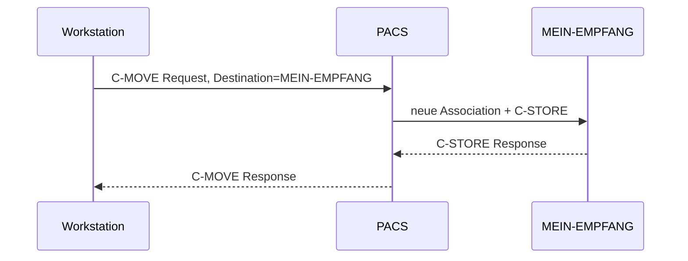

## „Ich sehe die Studie in der Suche, aber ich bekomme sie nicht zurück"

Die Befundstation findet eine alte Untersuchung per C-FIND. Patient, Datum und Study Instance UID stimmen. Beim Abruf bleibt der Zielordner leer.

Das wirkt paradox, bis du dir C-MOVE als zwei getrennte Vorgänge aufmalst:

1. Deine Workstation beauftragt das Archiv: „Sende diese Studie an `MEIN-EMPFANG`."
2. Das Archiv eröffnet **eine neue Association** zu `MEIN-EMPFANG` und sendet die Images per C-STORE.

Die zweite Association ist die häufig übersehene Rückrichtung.

<!-- kein-beispiel -->


## Der Ziel-AE ist mehr als ein Name

Damit das PACS `MEIN-EMPFANG` erreichen kann, muss es diesen AE Title einer Netzwerkadresse zuordnen können. Praktisch braucht die PACS-Konfiguration mindestens:

- AE Title des Ziels
- IP-Adresse oder Hostname
- Port, auf dem der Storage SCP lauscht
- gegebenenfalls erlaubte SOP Classes und Sicherheitsparameter

Der C-MOVE-Auftrag enthält den **Move Destination AE Title**, nicht automatisch dessen IP-Adresse und Port. Diese Zuordnung kennt das Archiv aus seiner lokalen Konfiguration.

## Erst den Empfänger starten

```text
$ storescp -aet MEIN-EMPFANG -od ./eingang 11112
```

**Was du daran abliest:** Auf Port `11112` wartet jetzt ein Storage SCP mit dem AE Title `MEIN-EMPFANG`. Genau dorthin muss das Archiv seine neue C-STORE-Association aufbauen können. `storescp` gibt dabei erst dann eine Zeile aus, wenn tatsächlich ein Objekt ankommt — bis dahin wartet es lautlos.

Danach kann die Workstation einen C-MOVE anfordern, mit der Study Instance UID aus `ct-thorax-60`:

```text
$ movescu -S -aet MEINE-WS -aec ORTHANC -aem MEIN-EMPFANG \
  -k QueryRetrieveLevel=STUDY \
  -k StudyInstanceUID=1.2.826.0.1.3680043.8.498.33163243562438835336213773414735255857 \
  127.0.0.1 4242
I: Sending Move Request: MsgID 1
I: Move SCP Response: 1 - 0xFF00 (Pending)
I: Sub-Operations Remaining: 2, Completed: 1, Failed: 0, Warning: 0
I: Move SCP Response: 2 - 0xFF00 (Pending)
I: Sub-Operations Remaining: 1, Completed: 2, Failed: 0, Warning: 0
I: Move SCP Result: 0x0000 (Success)
I: Sub-Operations Remaining: 0, Completed: 3, Failed: 0, Warning: 0
```

**Was du daran abliest:** `-aec ORTHANC` adressiert das PACS, `-aem MEIN-EMPFANG` benennt dagegen das Ziel, an das das PACS anschließend C-STORE senden soll — zwei verschiedene Rollen im selben Ablauf. Die "Sub-Operations"-Zeilen zählen die zweite, separate C-STORE-Association vom PACS zu `MEIN-EMPFANG` mit — nicht die Anfrage der Workstation selbst.

## Die häufigsten Fehlerklassen

### Move Destination ist unbekannt

Das PACS kennt `MEIN-EMPFANG` nicht. Dann kann es aus dem Namen keine Zieladresse bilden. Das ist ein Konfigurationsfehler im PACS oder Router, kein Suchproblem.

### Ziel ist bekannt, aber Port nicht erreichbar

Jetzt kennt das PACS IP und Port, bekommt aber keine TCP-Verbindung. Dann prüfst du Listener, Firewall, Routing und NAT aus Sicht **des PACS**, nicht aus Sicht der Workstation.

### Ziel nimmt die Association nicht an

TCP steht, aber der Empfänger lehnt Called/Calling AE Title oder die angebotenen Presentation Contexts ab. Dann bist du wieder auf DICOM-Ebene.

### Association steht, C-STORE scheitert

Das Retrieve wurde korrekt angestoßen, aber einzelne Images werden im zweiten Hop abgelehnt. Dann greift dieselbe C-STORE-Fehlersuche wie bei einer Modalität.

## Im Alltag heißt das

Für C-MOVE brauchst du eine kleine Dreiecksprüfung:

| Prüffrage | Richtung |
|---|---|
| Kann die Workstation das PACS per C-FIND/C-MOVE erreichen? | Workstation → PACS |
| Kennt das PACS den Move Destination AE? | PACS-Konfiguration |
| Kann das PACS den Ziel-SCP erreichen und dort speichern? | PACS → Ziel |

Wer nur die erste Verbindung testet, prüft nur die Hälfte des Workflows.

## Stolperfallen

- **C-MOVE mit Download verwechseln.** Der Requester muss nicht das Ziel sein.
- **Vom Client zum Ziel testen.** Entscheidend ist der Netzweg vom PACS zum Ziel.
- **C-ECHO zum PACS als Beweis verwenden.** Die spätere Storage-Association ist unabhängig.
- **Move Destination AE und Called AE des PACS verwechseln.** `ORTHANC` und `MEIN-EMPFANG` erfüllen unterschiedliche Rollen.

## Lab-Einstieg

Im Lab kennt das Archiv die gewünschte Studie. Der Abruf scheitert trotzdem. Deine Aufgabe ist nicht, die Studie zu finden, sondern die fehlerhafte Zielzuordnung zu identifizieren.

## Selbstcheck

1. Welche drei Systeme können bei einem C-MOVE beteiligt sein?
2. Woher kennt das PACS IP und Port der Move Destination?
3. Warum kann C-FIND funktionieren, obwohl C-MOVE scheitert?
4. Aus wessen Perspektive prüfst du Firewall und Routing zum Ziel-SCP?

## Quiz

*Wissenskarten — kommen später zur Wiederholung zurück.*

**q1 — Eine Workstation findet eine Studie per C-FIND, aber der anschließende C-MOVE bringt nichts zurück. Was ist die wahrscheinlichste Ursache?**
1. Die Studie existiert nicht im Archiv
2. PatientName ist falsch geschrieben
3. Das PACS kennt die Move Destination nicht oder hat falsche Host-/Portdaten für sie hinterlegt
4. C-FIND und C-MOVE nutzen unterschiedliche AE Titles der Workstation

**q2 — Welche Aussagen stimmen?** *(Mehrfachauswahl)*
1. C-MOVE besteht aus einem Auftrag ans Archiv und einer separaten C-STORE-Association vom Archiv zum Ziel
2. Der Move Destination AE Title ist automatisch mit derselben IP wie das anfragende System verknüpft
3. Das Archiv muss IP und Port des Ziel-AE aus seiner eigenen Konfiguration kennen, nicht aus dem C-MOVE-Request
4. C-FIND kann erfolgreich sein, während C-MOVE an der Zielverbindung scheitert
