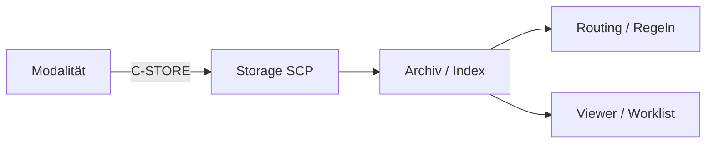

## „Die Modalität sagt erfolgreich gesendet"

Das CT zeigt für alle Bilder „Send successful“. Im PACS-Viewer findet die Anmeldung die Untersuchung trotzdem nicht.

Jetzt beginnt eine typische PACS-Admin-Falle: Weil die Oberfläche nichts zeigt, wird der Transfer erneut gestartet. Dann noch einmal. Später existieren drei Versandversuche, aber niemand hat geklärt, **an welcher Schicht** das Objekt tatsächlich verschwunden ist.

Ein erfolgreicher C-STORE ist ein wichtiger Beleg, aber nur für einen klar begrenzten Abschnitt: Der angesprochene Storage SCP hat das Objekt angenommen und einen Success-Status zurückgegeben.

## Vier Schichten statt einer Oberfläche

<!-- kein-beispiel -->


Für eine saubere Diagnose prüfst du die Schichten in dieser Reihenfolge.

### 1. Hat der Storage SCP den Transfer akzeptiert?

Beleg: C-STORE Response im Sender- oder Serverlog. Wenn hier ein Fehler steht, brauchst du noch nicht über Viewer-Filter nachzudenken.

### 2. Kann das Archiv die Studie selbst finden?

Ein Study-Root C-FIND trennt die Archivsuche von der GUI:

```text
$ findscu -S -aec ORTHANC \
  -k QueryRetrieveLevel=STUDY \
  -k PatientID=4711 \
  -k StudyInstanceUID= \
  127.0.0.1 4242
I: Find SCP Response: 1 - 0xFF00 (Pending)
I: # Response Identifier
I: (0008,0052) CS [STUDY]                                  #  1 QueryRetrieveLevel
I: (0008,0054) AE [ORTHANC]                                 #  1 RetrieveAETitle
I: (0010,0020) LO [4711]                                    #  1 PatientID
I: (0020,000D) UI [1.2.826.0.1.3680043.8.498.33163243562438835336213773414735255857] #  1 StudyInstanceUID
I: Find SCP Result: 0x0000 (Success)
```

**Was du daran abliest:** Liefert die Query die Study Instance UID zurück, kennt der DICOM-Index die Studie. Eine leere Viewer-Liste ist dann nicht mehr gleichbedeutend mit „nicht gespeichert“.

### 3. Ist das Objekt ein darstellbares Bild?

Seit Lektion 3.7 weißt du: Nicht jede Instance enthält Pixel. Ein SR, RDSR, KOS oder Encapsulated PDF kann korrekt im Archiv liegen und trotzdem an anderer Stelle der Oberfläche erscheinen.

### 4. Filtert die Anwendung den Treffer weg?

Viewer und RIS-Worklists filtern häufig nach Datum, Standort, Modalität, Status, Patientenkontext oder Benutzerberechtigung. Ein Archivtreffer und eine leere Anwenderliste können daher gleichzeitig korrekt sein.

## REST als zweite Sicht auf dasselbe Archiv

Bei Orthanc kannst du zusätzlich die Serverperspektive verwenden:

```text
$ curl -s http://127.0.0.1:8042/statistics
{
   "CountInstances" : 3,
   "CountPatients" : 1,
   "CountSeries" : 1,
   "CountStudies" : 1,
   "TotalDiskSize" : "2538",
   "TotalDiskSizeMB" : 0
}
```

**Was du daran abliest:** Das Archiv enthält Bestand. Die Statistik beweist noch nicht, dass genau deine gesuchte Studie vorhanden ist, aber sie zeigt, dass Storage und Datenbank grundsätzlich arbeiten. Für die konkrete Studie brauchst du weiterhin eine zielgerichtete Query.

## Im Alltag heißt das

Für ein Ticket „gesendet, aber nicht sichtbar“ dokumentierst du vier Belege:

| Ebene | Beleg |
|---|---|
| Sender | C-STORE Success für konkrete SOP Instance UID |
| Archiv | C-FIND oder interne Suche findet Study/Series/Instance |
| Objekttyp | SOP Class der fraglichen Instance |
| Anwendung | Filter, Berechtigung und Viewer-Support geprüft |

Damit kannst du präzise eskalieren: „Instance wurde um 10:42 angenommen und ist per Study UID im Archiv indexiert, erscheint aber für Benutzergruppe Radiologie nicht im Viewer“ ist eine andere Qualität als „PACS zeigt das Bild nicht“.

## Stolperfallen

- **Blind erneut senden.** Das erzeugt zusätzliche Ereignisse, bevor die Ursache bekannt ist.
- **Viewer-Suche mit Archivbestand gleichsetzen.** Eine UI ist nur eine Sicht auf den Bestand.
- **Nur nach PatientName suchen.** Identität und Schreibweisen können abweichen; UIDs sind für die technische Korrelation stabiler.
- **Jede Instance als Bild erwarten.** SOP Class prüfen.

## Lab-Einstieg

Im Lab ist der Storage-Transfer bereits erfolgreich gewesen. Du musst entscheiden, welche Beobachtung wirklich beweist, dass das Objekt im Archiv angekommen ist — und welche nur eine Oberfläche beschreibt.

## Selbstcheck

1. Was beweist ein C-STORE Success genau — und was nicht?
2. Warum ist ein C-FIND ein stärkerer Beleg für den Archivbestand als eine leere Viewer-Liste?
3. Nenne zwei Gründe, warum eine vorhandene Instance nicht als normales Bild sichtbar sein kann.
4. Welche UID würdest du für eine technische Eskalation mindestens dokumentieren?

## Quiz

*Wissenskarten — kommen später zur Wiederholung zurück.*

**q1 — Eine Modalität meldet C-STORE Success, im Viewer erscheint aber nichts. Was beweist dieser Erfolg allein?**
1. Dass der Viewer das Objekt korrekt anzeigen kann
2. Dass der angesprochene Storage SCP das Objekt angenommen hat
3. Dass das Objekt bereits im Archivindex durchsuchbar ist
4. Dass es sich um ein darstellbares Bild handelt

**q2 — Welche Aussagen stimmen?** *(Mehrfachauswahl)*
1. Ein C-FIND ist ein stärkerer Beleg für den Archivbestand als eine leere Viewer-Liste
2. Nicht jede Instance im Archiv ist ein darstellbares Bild
3. Ein Archivtreffer bei C-FIND beweist automatisch, dass der Viewer das Objekt anzeigen kann
4. Viewer und RIS-Worklists können gefundene Treffer durch eigene Filter ausblenden
