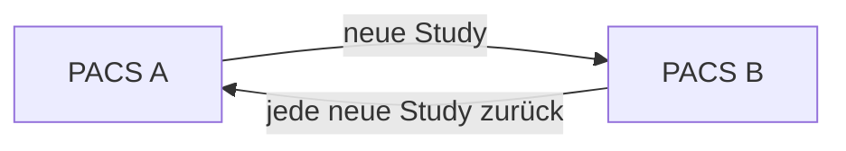

## „Warum wurde diese Studie an drei Systeme geschickt?"

Eine CT-Studie landet korrekt im PACS. Sekunden später taucht sie außerdem im Befundsystem, in einem KI-System und in einem Forschungsrouter auf. Niemand kann im Ticket erklären, welche Regel welchen Versand ausgelöst hat.

Solange die Daten ankommen, wirkt das harmlos. Bei einer falschen Patientenzuordnung oder einem Zielausfall wird aus dieser Unsichtbarkeit aber ein Betriebsproblem.

Ein DICOM-Router ist kein magischer Verteiler. Jede Route sollte sich als einfache Entscheidung beschreiben lassen:

<!-- kein-beispiel -->
```text
WENN <Trigger> UND <Bedingung>
DANN sende <Objekte> AN <Ziel>
UND dokumentiere <Ergebnis>
```

## Storage ist nicht Routing

C-STORE ins PACS beantwortet zunächst nur: Das Archiv hat ein Objekt entgegengenommen.

Eine nachgelagerte Route kann darauf reagieren und eine **neue** Association zu einem anderen Ziel aufbauen. Damit entstehen neue Fehlerorte:

- Ziel-AE unbekannt
- Ziel-Port nicht erreichbar
- SOP Class nicht unterstützt
- Queue wächst
- Retry läuft endlos
- Regel matcht zu breit oder gar nicht

Darum darf „im PACS angekommen“ nicht mit „an alle Ziele verteilt“ gleichgesetzt werden.

## Eine Routingregel lesbar machen

Nimm eine Regel wie:

<!-- kein-beispiel -->
```text
Trigger: neue Study vollständig
Bedingung: Modality=CT UND BodyPartExamined=CHEST
Ziel: AI-CHEST
Objekte: komplette Study
Retry: 3 Versuche, danach Fehlerqueue
```

Sie beantwortet fünf Fragen. Wenn eine produktive Regel diese Antworten nicht dokumentiert, ist ihre Fehlersuche unnötig schwer.

## Prefetch ist Routing mit zeitlichem Auslöser

Prefetch holt häufig ältere Vergleichsuntersuchungen in einen schnelleren Cache oder auf eine Workstation, bevor der Anwender sie manuell anfordert.

Der Trigger kann beispielsweise ein neuer Auftrag oder eine neue Untersuchung sein. Danach sucht das System passende Voruntersuchungen und ruft sie ab.

Damit kombiniert Prefetch meist **Query/Retrieve und Routing**. Ein Fehler kann deshalb sowohl in der Suche als auch im anschließenden Transfer liegen.

## Routing-Loops

Ein klassischer Betriebsfehler entsteht, wenn zwei Systeme dieselben Objekte gegenseitig als „neu“ erkennen:

<!-- kein-beispiel -->


Gute Systeme erkennen Duplikate oder behalten Original-/Source-Informationen. Trotzdem sollte die Route selbst so entworfen sein, dass kein Loop nötig ist, um den Schutzmechanismus zu testen.

## Wie du eine Route abnimmst

Verwende eine kontrollierte Teststudie und dokumentiere mindestens:

1. Study Instance UID.
2. Triggerzeitpunkt.
3. welche Regel gematcht hat.
4. Ziel-AE.
5. Anzahl erwarteter Instances.
6. Anzahl gesendeter/fehlgeschlagener Instances.
7. Resultat am Ziel.
8. Verhalten bei absichtlich nicht erreichbarem Ziel.

Der letzte Punkt ist wichtig: Eine Route ist erst betrieblich verstanden, wenn klar ist, was bei Fehlern passiert — Retry, Queue, Alarm oder stilles Verwerfen.

## Im Alltag heißt das

| Beobachtung | Nächste Frage |
|---|---|
| Studie im PACS, nicht am Ziel | Hat die Regel überhaupt gematcht? |
| Job existiert, bleibt hängen | Ist das Ziel erreichbar? |
| Job scheitert sofort | Association/SOP Class/Policy prüfen |
| Ziel erhält Duplikate | Retry oder Loop? |
| Falsche Studien am Ziel | Bedingung zu breit? |
| Queue wächst | Zielproblem plus fehlende Betriebsgrenze/Alarmierung |

Routing ist damit nicht nur Integration, sondern auch Queue- und Fehlerbetriebsführung.

## Stolperfallen

- **Regeln nur nach Anzeigenamen dokumentieren.** Für Diagnose brauchst du konkrete Bedingungen und Ziele.
- **Retry mit Erfolg verwechseln.** Ein Job kann mehrfach scheitern, bevor er endgültig fehlschlägt.
- **Keine Queue-Grenze überwachen.** Ein Zielausfall kann Stunden später den PACS-Betrieb belasten.
- **Loops nur durch Duplikaterkennung verhindern.** Besser ist ein eindeutiger Datenfluss.
- **Prefetch als reines Storage-Thema behandeln.** Es beginnt oft mit einer Query.

## Selbstcheck

1. Aus welchen vier Kernteilen besteht eine verständliche Routingregel?
2. Warum kann eine im PACS gespeicherte Studie trotzdem nie am Routenziel ankommen?
3. Welche zwei DICOM-Funktionsgruppen kombiniert Prefetch häufig?
4. Warum sollte ein Abnahmetest auch ein absichtlich nicht erreichbares Ziel enthalten?

## Quiz

*Wissenskarten — kommen später zur Wiederholung zurück.*

**q1 — Eine Studie ist korrekt im PACS gespeichert, kommt aber nicht am vorgesehenen Routing-Ziel an. Was ist die naheliegendste erste Prüfung?**
1. Ob der ursprüngliche C-STORE erfolgreich war
2. Ob die Routingregel überhaupt gematcht hat
3. Ob das PACS neu gestartet werden muss
4. Ob die Modalität online ist

**q2 — Welche Aussagen stimmen?** *(Mehrfachauswahl)*
1. Eine Routingregel lässt sich in Trigger, Bedingung, Ziel und Ergebnis zerlegen
2. Prefetch kombiniert häufig Query/Retrieve und Routing
3. Ein erfolgreicher C-STORE ins PACS beweist automatisch, dass alle Routen ausgelöst wurden
4. Ein Abnahmetest für eine Route sollte auch ein absichtlich nicht erreichbares Ziel enthalten
